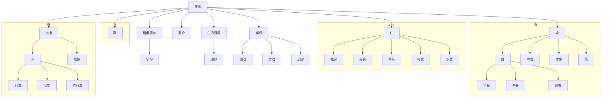
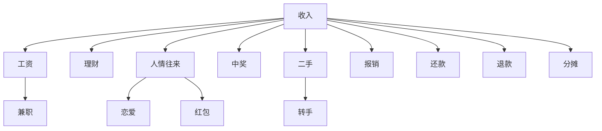
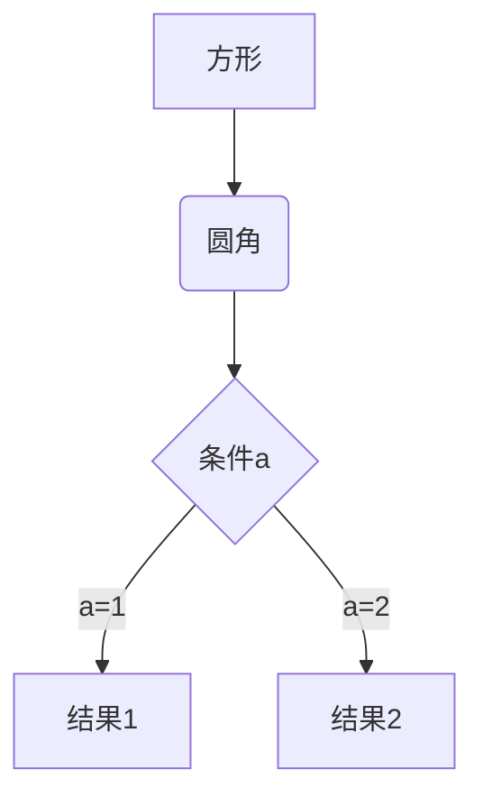
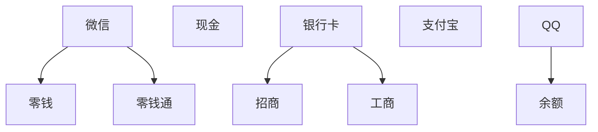

标签与类别

记账薄 数据库

1、cashbook App 数据库

类别：billCategory （账单类别）

|    类别名    |  创建时间  |  父类别  | 备注 |
| :----------: | :--------: | :------: | ---- |
| categoryName | createTime | parentId | note |

支出，收入，内部转账    为 根类别

支出： 餐，零食，房租，电器，恋爱，转帐，水果

收入： 工资，理财

采用标签与分类结合的方式，若只用类，那么拓展起来比较麻烦，用标签的话比较灵活

详细的类别：衣，食，住，行；医疗，娱乐，通讯，人情往来，理财，丢失，增值服务

2、账户：account

|   账户名    |  创建时间  |  金额  | 备注 | 单位 |
| :---------: | :--------: | :----: | ---- | ---- |
| accountName | createTime | amount | note |      |

微信：

支付宝

现金

银行卡

3 、收支记录 tradeRecode
    

| 交易记录名 | 交易时间  |   账户    |    类别    |  金额  |   备注    |   交易对象   |代付对象|退款|
| :--------: | :-------: | :-------: | :--------: | :----: | :-------: | :----------: |:----------: |:----------: |
| tradeName  | tradeTime | accountId | categoryId | Amount | tradeNote | tradeAccount |refundId|

支付对象：给谁买单，复数，；分割

4、billFlag 标签
|   标签名    |  创建时间  |  备注    |
| :---------: | :--------: | :--: |
| accountName | createTime |  note    |

